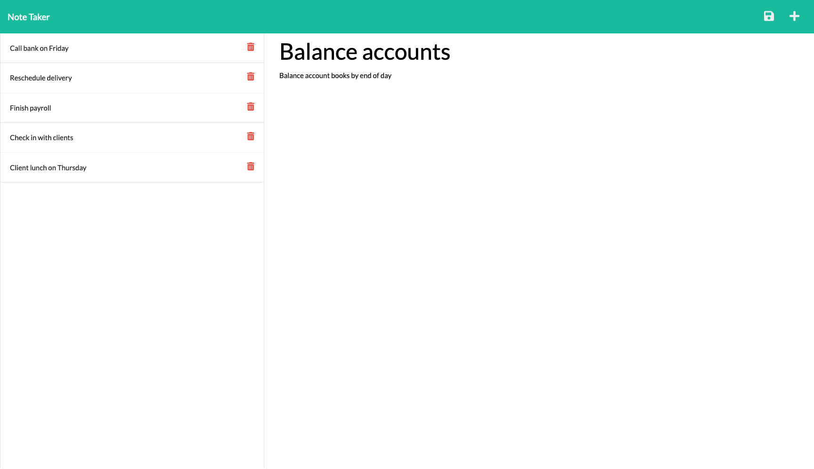

# Note Taker

## Description
This application uses an Express.js backend and saves and retrieves note data from a JSON file.

## License

  
This project is licensed under the MIT License.

For more information on this license, please visit [their website](https://www.mit.edu/~amini/LICENSE.md).

## Deployment
[Deployment Link](https://glacial-savannah-45026.herokuapp.com)

## Contact
If you have any questions, you can find me [here](https://yyb613.github.io/portfolio).
